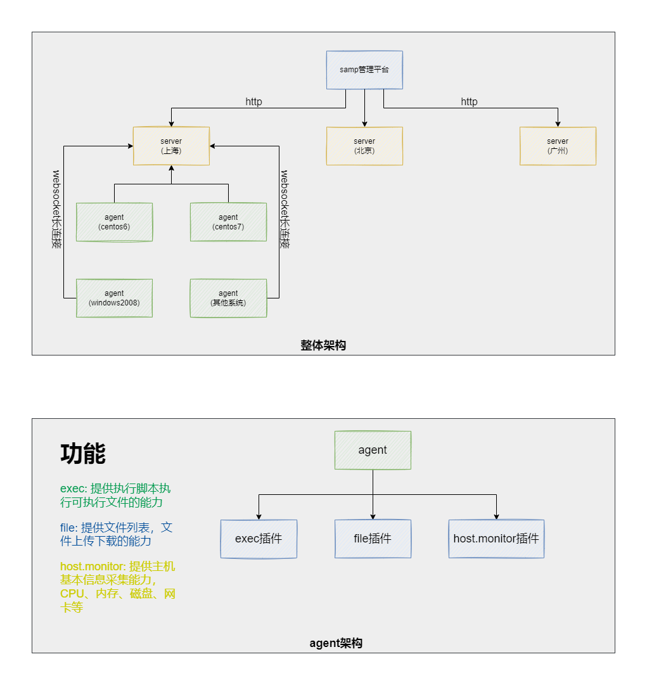

# SmartAgent

SmartAgent 采用C/S架构的模型来运行，两者之间采用ws协议保障在企业级网络策略中通信能力。为提高可扩展性，在Agent端使用多进程的方式运行多种插件，来提供业务方的扩展能力。

## API接口索引

### 获取Server相关信息
[Read More 👉🏻](/smartagent/server/api/server/info)

### 获取Agent列表
[Read More 👉🏻](/smartagent/server/api/host/list)

### 查找Agent
[Read More 👉🏻](/smartagent/server/api/host/search)

### 获取Agent基本信息
[Read More 👉🏻](/smartagent/server/api/host/info)

### 获取Agent详细信息
[Read More 👉🏻](/smartagent/server/api/hm/static)

### Agent执行命令
[Read More 👉🏻](/smartagent/server/api/cmd/run)
