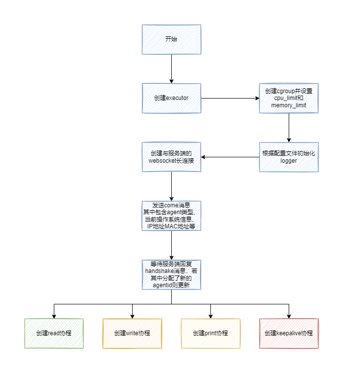
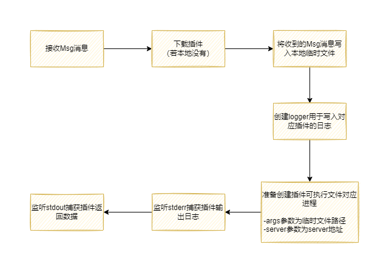

# 实现原理

smartagent底层通过websocket协议进行服务端与客户端的RPC通信，同时通过内部的心跳机制来进行节点保活，从宏观上看agent的处理逻辑如下

1. smartagent底层使用websocket协议与服务端进行连接，在连接过程中含有一次握手的过程，握手过程中agent会上报配置文件中的agent_id信息与当前操作系统信息，服务端在收到握手信息后会通过[manifest.json](https://github.com/jkstack/scaffolding/blob/master/manifest.json)中的描述信息来分发对应操作系统的插件
2. 握手过程中若发现当前上报的agent_id已存在（当前活跃连接中已包含该agent_id的agent连接）则会返回握手失败消息并告知id冲突
3. executor为插件执行器，在非windows操作系统下支持插件切换到其他用户身份运行
4. smartagent使用[containerd/cgroups](https://github.com/containerd/cgroups)库来限制linux系统下的资源使用，目前仅支持cgroups v1

## executor与插件化

executor是smartagent中的插件执行器，目前实现了以下功能：

1. 下载并管理插件的可执行文件，当某个插件的低版本所有进程退出时进行旧版本文件清理
2. 插件运行时参数配置信息生成，插件的运行参数将会被写入到临时文件内，插件运行参数通过临时文件尽心传递，在运行完毕后该临时文件将会被删除
3. 插件运行时的日志将会通过stderr进行输出，executor在收集到日志后将会在每一行前面加上时间
4. 插件返回数据可通过stdout进行输出，每一次插件运行允许输出多条数据，输出的格式如下

        <length(4字节)><crc32(4字节)><payload>
5. 插件的基本实现原理如下

    
